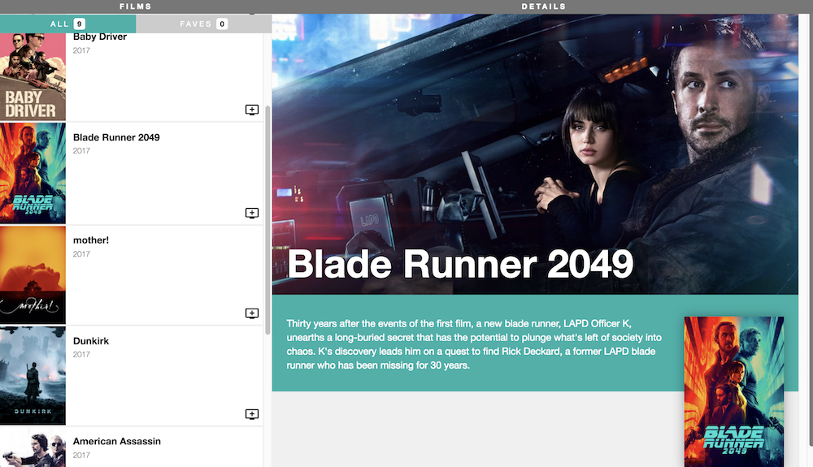

# Homework: A film Browser

We're going to continue where we left off with our Film browser app.

By the end of today's homework, we're going to change the Movie API to load data from our own database, and display the detail view when you click on each movie.

## Part 1: Loading from a database

*   The movie data is hard-coded into the `server.js` file. Take a look at what data is provided in each movie. Hard-coded data doesn't scale! Let's move this into a database. Create a `database/schema.sql` which creates a database and a table for `movies` and a `database/seed.sql` file which inserts a few movies into the database.
*   Install `pg-promise` and write a `database/connection.js` file to connect to your database.
*   Write a `models/Movie.js` file which has a method `getMovies()` which returns a Promise which wraps results from the database.
*   Remove the hard-coded `movies` data in `server.js`. Change the `GET api/movies` endpoint to respond with the results from `Movie.getMovies()`
*   Confirm that your data in your React app is now loading from your database by looking at it in the browser!

## Part 2: Movie Detail view

*   When a user clicks on a `FilmListItem`, we should see more information about the film in our right-hand pane `FilmDetails`.
*   HINTS:
    *   We need to change the state of our App to keep track of what film is currently being displayed. We should only store the minimal information (an ID) of the film being displayed. Revisit [this part of last night's reading](https://reactjs.org/docs/thinking-in-react.html#step-3-identify-the-minimal-but-complete-representation-of-ui-state) for a refresher on storing the minimal representation of state
    *   We need an event listener to listen for the click event on `FilmListItem`.
    *   We need to pass down extra data to the FilmDetails component. Apply conditional rendering!
    *   Make the movie detail view look like this:

## Part 3: Movie CRUD!

*   Implement ALL CRUD endpoints in your Express server for the movie model. Confirm that they work using Postman.
*   POST `/api/movie`
*   GET `/api/movie/:id`
*   PUT `/api/movie/:id`
*   DELETE `/api/movie/:id`
