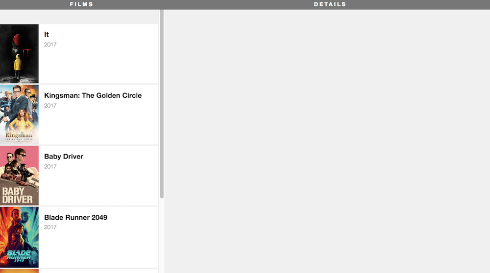

#  Homework: Starting a Film Project and ReactJS documentation reading

Fork and clone this repository.

This project was created with `create-react-app`. Once you have the app cloned, you should run `npm install`. You can then run it with `npm run start`.

## FOR TUESDAY

 - Read [our React cheat sheet](https://git.generalassemb.ly/wdi-nyc-ewok/ewok-class-info/wiki/React-Cheat-Sheet), review your notes, and make sure you are comfortable with all the concepts we've already covered.
 - Read [the React documentation](https://reactjs.org/docs/handling-events.html), sections `Handling Events` through `Thinking in React`.
 - Complete Steps 1-8 in the film app
 - Answer the questions in `QUESTIONS-TUESDAY.md`

The plan is to identify the app components, create the overall structure, then split that structure into individual components. You'll pass films as props to each component and ultimately use iteration to render one component for each film. At the end of this exercise, you will have this app:



Also, 

### Tasks

In the *root* of this repository, run `node server.js` to start the API server which will serve movie data.

In the `app` directory, run `yarn start` to start the React server for your front-end app.

**Importantly**: After each step below, check your application to see how it looks before going to the next one. It's good practice to be sure your app is working correctly before adding new functionality.

<details>
  <summary>Hint</summary>
  Don't forget any <code>import</code> statements as you add more files.
</details>

#### Step 1: Create baseline layout

First, create the layout. You'll have a Films column and a Details column.

Make the provided `App` component render the following code:

```html
<div className="film-library">
  <div className="film-list">
    <h1 className="section-title">FILMS</h1>
  </div>

  <div className="film-details">
    <h1 className="section-title">DETAILS</h1>
  </div>
</div>
```

#### Step 2: Create new components

Move the `film-list` and `film-details` into their own separate components (in separate files), `FilmList` and `FilmDetails`, respectively.

Make sure you now call these components in `App.js`. Check your app in the browser. If you've done it right, nothing will have changed, and the application will look the same.

#### Step 3: Pass props to the new components

In your `App` component, make a call to your Movies API server at `http://localhost:4567/api/movies` in the a `componentDidMount()` method, and store the results in the `App` component's state.

Pass the movies to the `FilmList` component.

If you check your file, it still shouldn't look differently. We're sending the props to the components, but we are not using the props yet.

#### Step 4: Render a film

In the `FilmList` component, render the title of just 1 film as an `<h1>`, below the `section-title`.

Does "It" appear on the left side of your browser?

<details>
  <summary>Hint</summary>
  The films prop is an array, and you just want the title from the first one.
</details>

#### Step 5: Create and render an array of film title elements

Use `.map()` inside of the `FilmList.render` method to iterate over the collection of films and create a React element for each one's title.

You should have a list of all the films appear in the left column.

#### Step 6: Move the film rows to their own component

Create a new component for each film row, called `FilmListItem`. Have your `map` instead create an array of `FilmListItem`s. Don't forget to pass the individual film prop to the component when creating them!

Once you have this working, also pass `film.id` as a `key` prop to `FilmRow`, though you won't use it yet. 

#### Step 7: Flesh out each film item

Make each `FilmListItem` look like the main finished image, using the following markup.

#### BONUS

